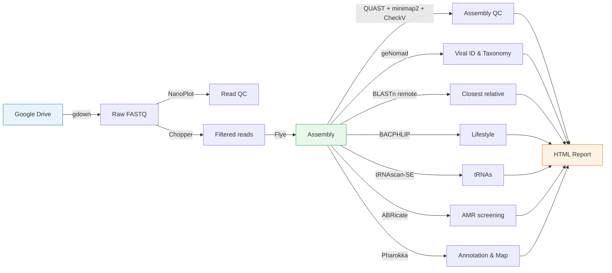

# NanoPhage

Nextflow pipeline for Nanopore phage genome assembly and characterization.

## Pipeline overview



## Quick start

```bash
git clone https://github.com/wgiovanni13/nanophage.git
cd nanophage
nextflow run main.nf
```

All tools are installed automatically via Conda. Databases (CheckV, geNomad, Pharokka) are downloaded during execution.

## Requirements

- Nextflow ≥ 24.10
- Conda or Mamba
- Internet access (for Google Drive download, remote BLAST, and database downloads)

## Parameters

| Parameter    | Default | Description                     |
|--------------|---------|---------------------------------|
| `--file_id`  | (set)   | Google Drive file ID            |
| `--filename` | (set)   | Output filename for raw reads   |
| `--outDir`   | results | Output directory                |
| `--min_len`  | 500     | Minimum read length             |
| `--min_qual` | 10      | Minimum quality score (Phred)   |

## Output

```
results/
├── 00_raw/                    Downloaded FASTQ
├── 01_read_qc/                NanoPlot stats and plots
├── 02_filtered/               Filtered reads and report
├── 03_assembly/               Flye assembly and info
├── 04_assembly_qc/            QUAST, coverage, CheckV
├── 05_characterization/       geNomad, BLAST, BACPHLIP, tRNAs, AMR, Pharokka
└── 06_report/                 nanophage_report.html
```

## Cluster configuration

Edit `nextflow.config` to match your HPC:

```nextflow
process {
    executor = 'slurm'    // or 'local', 'pbs', 'sge' depending on your HPC workload manager name
    queue    = 'm'        // or 'batch' depending on your HPC queue's name
    qos      = 'medium'   // or 'm' depending on your HPC qos' name
}
```

## Author

Wagner Giovanni Guzman Mendez
